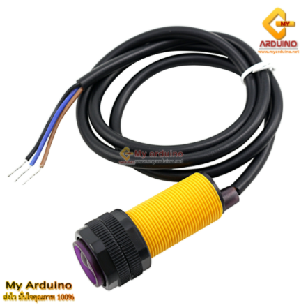
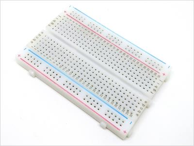
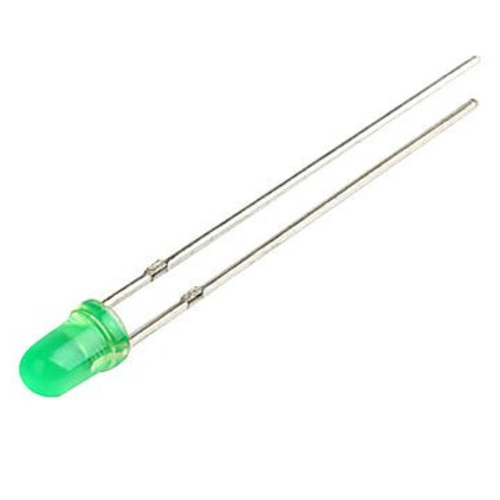
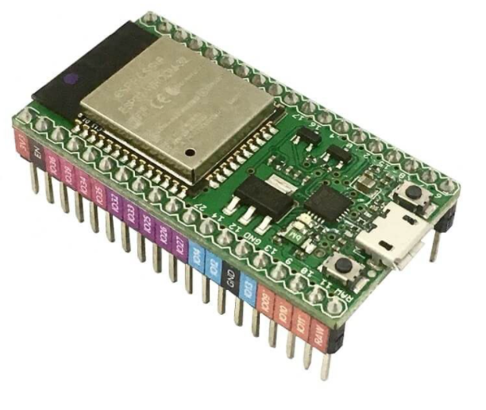

# CPE-Project
<<<<<<< HEAD
 61024246 ธิณกร อุบลจินดา

61012139 อธิภัทร เหลือชั่ง

61024304 จักริน แหลมจันทึก

Model(คราวๆ)

<<<<<<< HEAD
=======
Version Test 
อันนี้เอาไว้สำหรับโค้ดแบบไม่สมบูรณ์ 
>>>>>>> dev
=======

เส้นผ่านศูนย์กลาง: 17 มม.

Size:8.2cm x 5.5cm 

LED ขนาด 5mm(จะเปลี่ยนแปลงในภายหลัง)

Size:5.8 x 2.8 cm

>>>>>>> 658b49240b4751361fd685abf34ef24c35c707b9
