# CPE-Project
<<<<<<< .merge_file_a22228

Hardware

61012139 อธิภัทร เหลือชั่ง

อุปกรณ์

1.DHT22

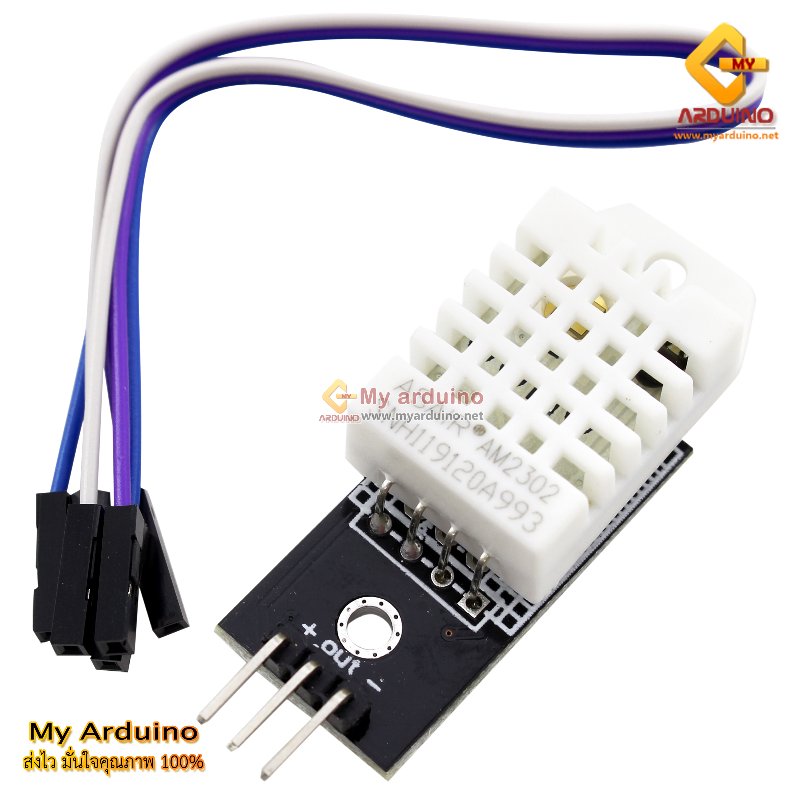

2.LCD

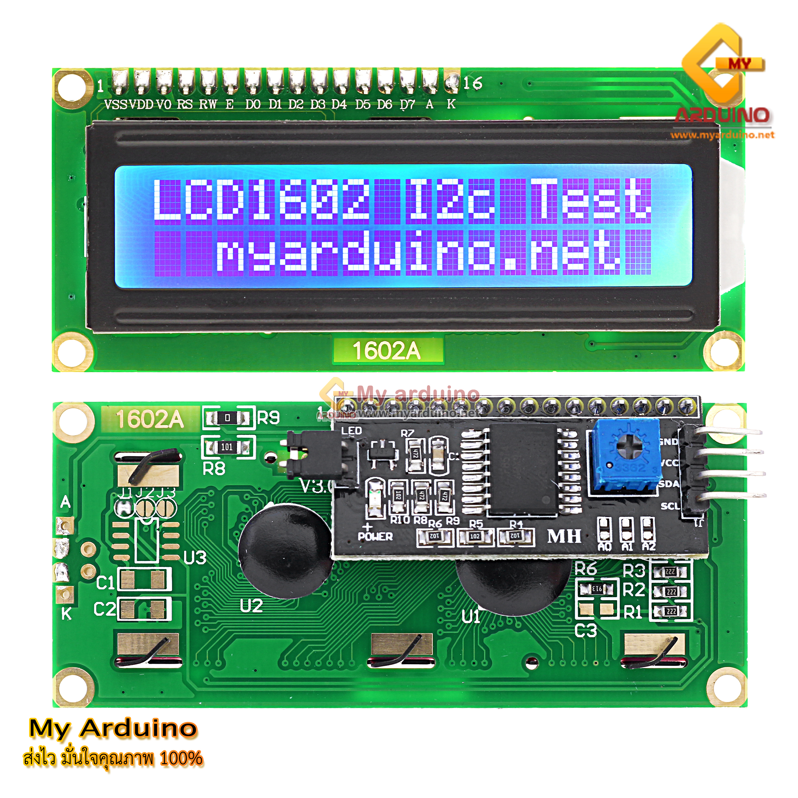

  
3.Battery 12v

  
  
4.Soil moisture sensor module

  
  
5.Relay 1 channel module 5v

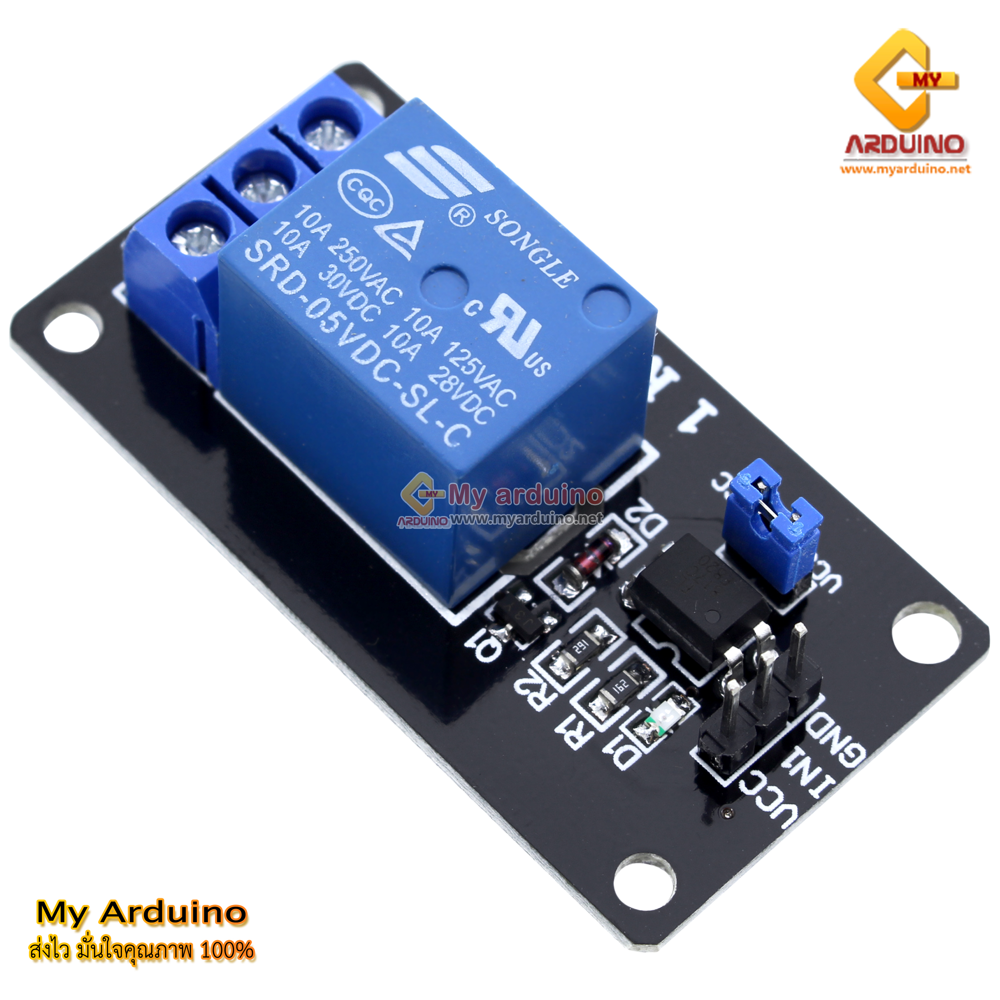
  
  
6.Pump 12v

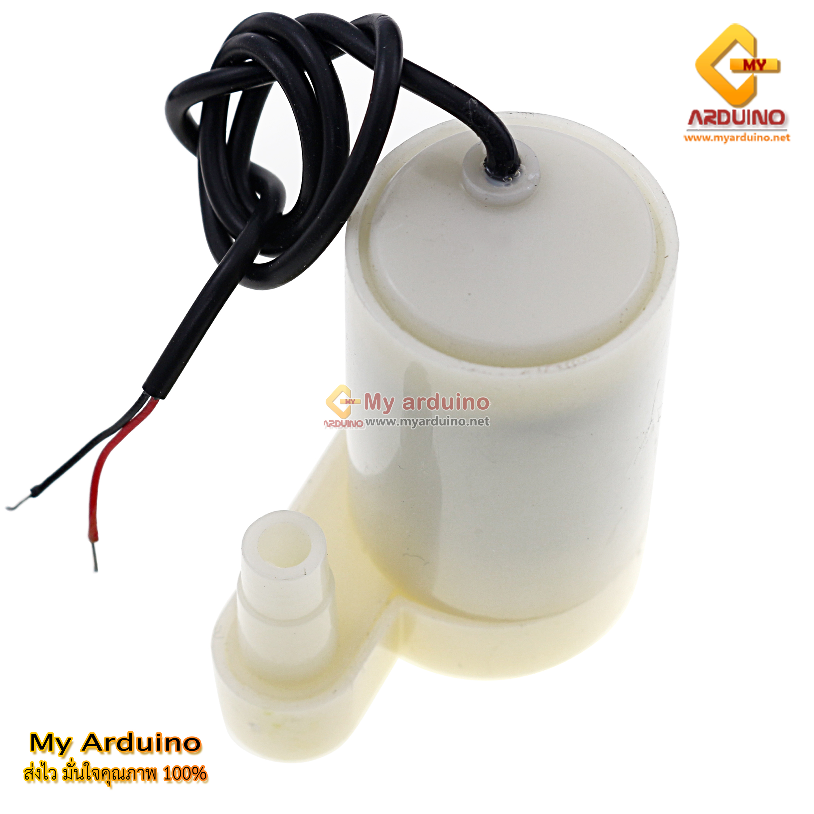
  
 
7.ESP32

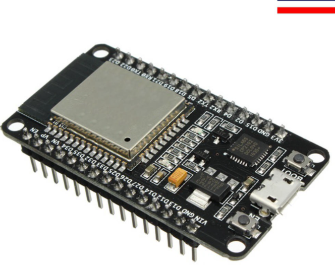
  
  
8.กล่องบรรจุภาชนะ

รูปประกอบ HARDWARE

  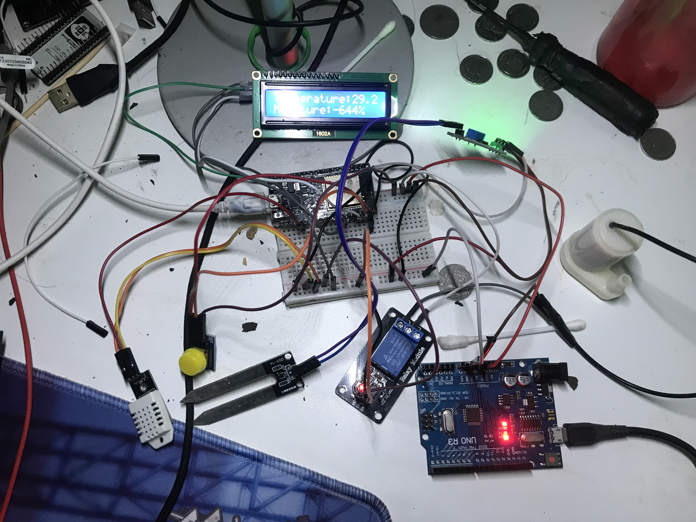
  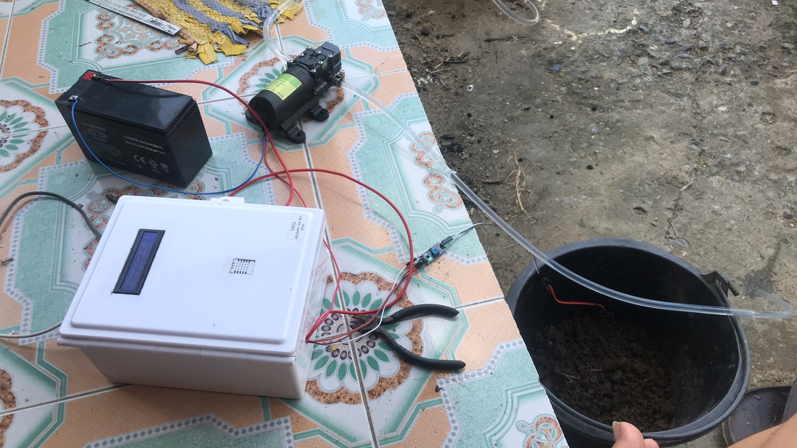
  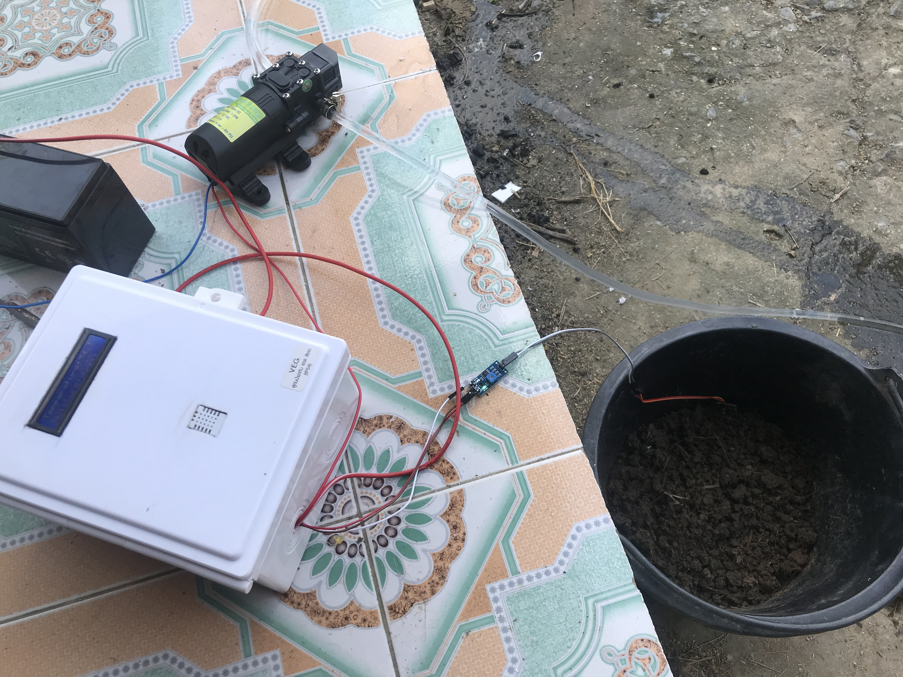
  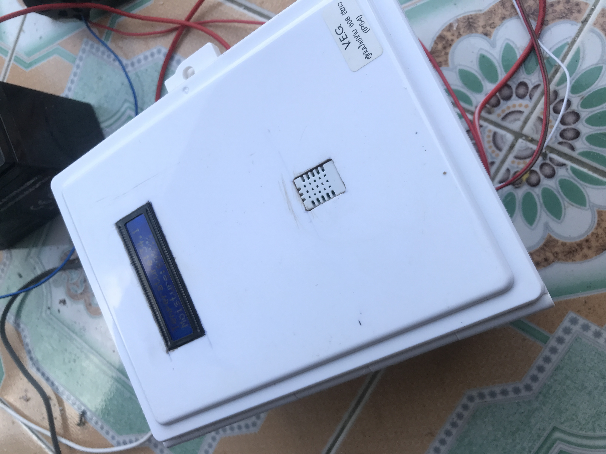
  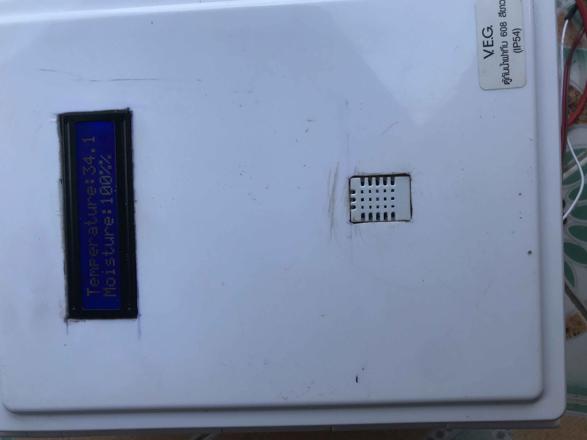
  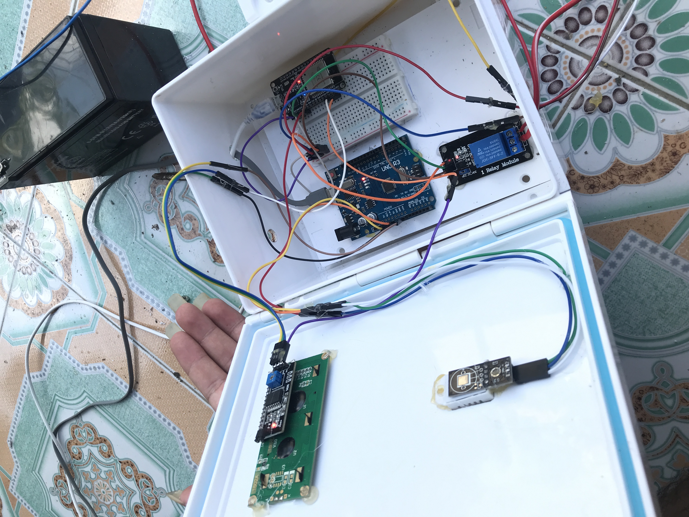
=======
