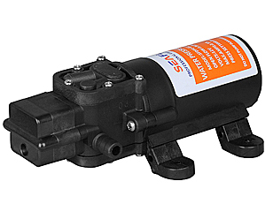
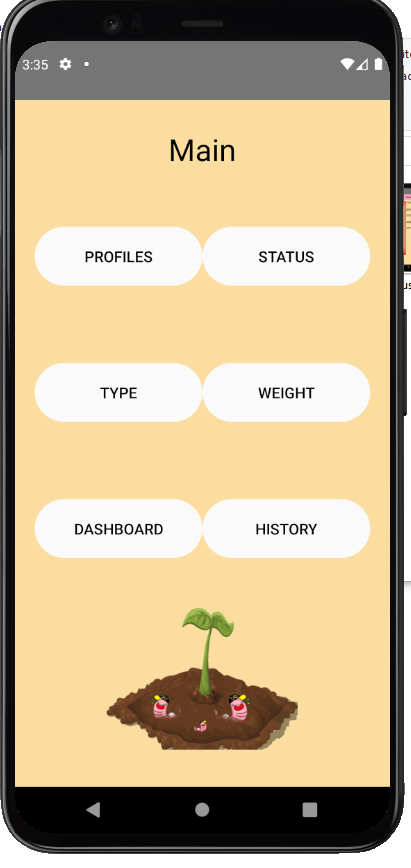
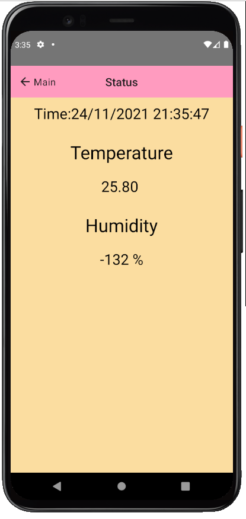

# CPE-Project

61012139 อธิภัทร เหลือชั่ง
 
Hardware (Arduino,Embeded)

61024304 จักริน แหลมจันทึก
 
Software (Node-red, API, PHP,SQL)

 61024246 ธิณกร อุบลจินดา
 
Application Design(React-native)

=======
=======

>>>>>>> Hardware

Hardware

61012139 อธิภัทร เหลือชั่ง

อุปกรณ์

1.DHT22

<<<<<<< HEAD

2.LCD

  
3.Battery 12v

  
  
4.Soil moisture sensor module

  
  
5.Relay 1 channel module 5v

  
  
6.Pump 12v

  
 
7.ESP32

  
  
8.กล่องบรรจุภาชนะ

รูปประกอบ HARDWARE

  
  
  
  
  
  
=======

=======
>>>>>>> App

Application Design(React-native)

 61024246 ธิณกร อุบลจินดา

หน้า Login 

หน้า Register

หน้า Main เอาไว้เชื่อมไปยังหน้าอื่นๆ

หน้า Profiles เอาไว้สำหรับแสดงข้อมูลผู้ใช้

หน้า status เอาไว้โชว์ค่าที่ hardware ส่งขึ้นมา

หน้า Type จะโชว์ชนิดของไส้เดือนที่นิยมเลี้ยงในไทย

หน้า Weight เอาไว้สำหรับ Input นำหนักลงไปแล้วจะเอามาแสดงด้านล่าง

หน้า Dashboard จะโชว์กราฟของค่าที่ hardware ส่งมา

หน้า history จะแสดงค่า temp ,humid, time ทุกๆ3ชม.

=======

=======

SOFTWARE

61024304 จักริน แหลมจันทึก

<h1>API</h1>

<h4>user = เก็บค่าข้อมูลการสมัครและเอาไปแสดงค่าแบบเรียกใช้ ID</h4> 
<h4>history = นำค่าอุณภูมิ ความชื้นและเวลามาแสดงทุกๆ3ชั่วโมง</h4> 
<h4>weight = นำน้ำหนักและเวลามาแสดง</h4> 

<h1>MySQL(Temp)</h1>

<h4>Table Temp</h4>
<h4>เก็บค่า ID(เช็คแก้ไขและเรียกดึงข้อมูลเป็นชุดตามID)temp(อุณภูมิ) humi(ความชื้น) Time(เวลา) </h4>

<h1>MySQL(User)</h1>

<h4>Table User</h4>
<h4>เก็บค่า ID(เช็คแก้ไขและเรียกดึงข้อมูลเป็นชุดตามID) fistname(ชื่อจริง) lastname(นามสกุล) username(ตั้งชื่อ) password(ตั้งรหัส) </h4>
<h4>email(อีเมล์) phone(เบอร์โทร)</h4>

<h1>MySQL(User)</h1>

<h4>เก็บค่า Weight(น้ำหนัก) </h4>
<h1>Node Red</h1>

<h4>ใช้ฟังชันส่งค่าแยกไปตามตารางในMySQL</h4>
=======

