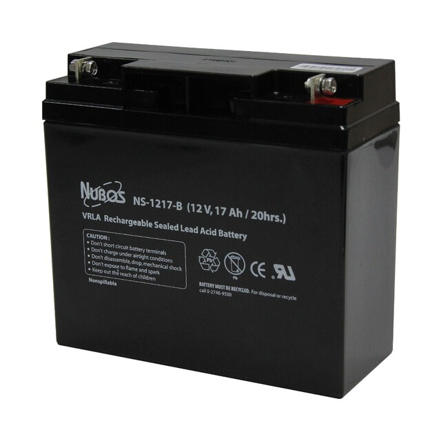

# CPE-Project
<h1>Hardware<h1>

61012139 อธิภัทร เหลือชั่ง

อุปกรณ์

1.T22

2.LCD

  
3.Battery 12v

  
  
4.Soil moisture sensor module

  
  
5.Relay 1 channel module 5v

  
  
6.Pump 12v

  
 
7.ESP32

  
  
8.กล่องบรรจุภาชนะ

